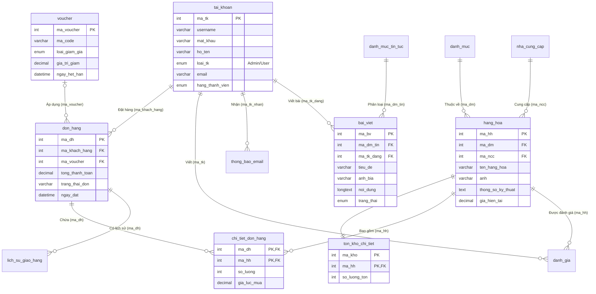

# LENS & LIGHT - Nền Tảng Thương Mại Điện Tử & Blog Nhiếp Ảnh

LENS & LIGHT là một hệ thống thương mại điện tử (E-commerce) chuyên biệt kết hợp nền tảng quản lý nội dung (CMS/Blog) dành riêng cho lĩnh vực nhiếp ảnh. Hệ thống được phát triển dựa trên mô hình MVC (Model-View-Controller) bằng PHP thuần và cơ sở dữ liệu MySQL, đem lại hiệu suất cao, dễ dàng mở rộng và bảo trì.

---

## 🌟 Tính Năng Nổi Bật (Features)

### Dành Cho Khách Hàng (Client)
- **Trải Nghiệm Mua Sắm (Shopping):** Tìm kiếm, lọc sản phẩm (Máy ảnh, Ống kính, Phụ kiện), xem chi tiết thông số kỹ thuật (JSON format) và tình trạng tồn kho.
- **Giỏ Hàng & Thanh Toán:** Thêm vào giỏ hàng (sử dụng LocalStorage/Session), áp dụng mã giảm giá (Voucher), đặt hàng và theo dõi trạng thái vận chuyển.
- **Tài Khoản & Cá Nhân Hóa:** Đăng ký, đăng nhập, phân hạng thành viên (Silver, Gold, Diamond), tích lũy điểm và xem lịch sử mua hàng.
- **Đánh Giá (Reviews):** Viết đánh giá, chấm điểm sao cho sản phẩm đã mua.
- **Blog (Bài Viết):** Đọc các bài viết chia sẻ kiến thức nhiếp ảnh, tin tức khuyến mãi với giao diện thiết kế siêu hiện đại, hỗ trợ chuẩn SEO.

### Dành Cho Quản Trị Viên (Admin Panel)
- **Quản Lý Bảng Điều Khiển (Dashboard):** Biểu đồ doanh thu (Chart.js), thống kê đơn hàng, lượng khách hàng mới và top sản phẩm bán chạy/bán ế.
- **Quản Lý Sản Phẩm (Products):** Thêm, sửa, xóa sản phẩm. Hỗ trợ Upload file vật lý thay vì Base64 giúp tối ưu Database. 
- **Quản Lý Đơn Hàng (Orders):** Duyệt đơn, cập nhật trạng thái giao hàng, theo dõi toàn bộ lịch sử (Log) của đơn hàng.
- **Quản Lý Bài Viết (CMS):** Tích hợp trình soạn thảo nội dung phong phú (CKEditor 5) cho phép chèn ảnh trực tiếp vào bài viết.
- **Quản Lý Voucher & Khuyến Mãi:** Tạo mã giảm giá (Phần trăm hoặc Tiền mặt), điều kiện áp dụng và quản lý thời hạn.

---

## 📂 Cấu Trúc Thư Mục (Directory Structure)

```text
webmayanh/
├── admin/               # Router định tuyến riêng cho khu vực Admin
├── assets/              # Chứa toàn bộ tài nguyên tĩnh (Static Files)
│   ├── css/             # Stylesheets (Client & Admin)
│   ├── js/              # Javascript Modules (Xử lý giỏ hàng, phân trang, Ajax...)
│   └── images/          # Hình ảnh giao diện cơ bản
├── control/             # [C] Controllers: Xử lý logic và nghiệp vụ chính
├── model/               # [M] Models: Thực thi các câu lệnh truy vấn Database (PDO)
├── view/                # [V] Views: Giao diện người dùng (HTML/PHP Mix)
│   ├── admin/           # Giao diện dành cho Quản trị viên
│   └── client/          # Giao diện dành cho Khách hàng
├── uploads/             # Nơi lưu trữ file vật lý được tải lên
│   ├── products/        # Ảnh sản phẩm
│   └── articles/        # Ảnh bìa và ảnh nội dung bài viết
├── data/                # Chứa file SQL khởi tạo cấu trúc CSDL
├── index.php            # Router chính yếu (Front Controller) của toàn bộ hệ thống
└── config.php           # Cấu hình môi trường (Biến CSDL, Mailer...)
```

---

## 🗄️ Cấu Trúc Cơ Sở Dữ Liệu (ERD Diagram)

Dưới đây là sơ đồ Thực thể - Mối liên kết (Entity-Relationship Diagram) của hệ thống. 
Cơ sở dữ liệu sử dụng MySQL (InnoDB) với các Ràng buộc khóa ngoại (Foreign Keys) đầy đủ để đảm bảo tính toàn vẹn dữ liệu (Data Integrity) qua cơ chế `ON DELETE CASCADE` và `SET NULL`.



### Các liên kết khóa chính yếu:
- **`hang_hoa.ma_dm`** -> Tham chiếu đến **`danh_muc.ma_dm`** (Để phân loại Camera, Lens, v.v...).
- **`hang_hoa.ma_ncc`** -> Tham chiếu đến **`nha_cung_cap.ma_ncc`** (Xác định thương hiệu Sony, Canon, v.v...).
- **`chi_tiet_don_hang`** -> Bảng trung gian giải quyết quan hệ *n-n* giữa **`don_hang`** và **`hang_hoa`**.
- **`bai_viet.ma_tk_dang`** -> Tham chiếu đến **`tai_khoan.ma_tk`** (Xác định tác giả của bài viết).

---

## 🚀 Hướng Dẫn Cài Đặt (Installation)

1. **Yêu cầu hệ thống:**
   - XAMPP/WAMP (PHP 7.4 hoặc 8.x trở lên).
   - MySQL / MariaDB.

2. **Cài đặt Database:**
   - Mở phpMyAdmin, tạo một Database trắng có tên là `webmayanh` (Charset: `utf8mb4_unicode_ci`).
   - Import file `data/webmayanh_structure.sql` vào Database vừa tạo.

3. **Cấu hình dự án:**
   - Đặt toàn bộ mã nguồn vào thư mục `htdocs` (nếu dùng XAMPP) với tên thư mục là `webmayanh`.
   - Nếu bạn cấu hình tên Database khác hoặc cấu hình mật khẩu MySQL khác, vui lòng vào file `model/database.php` để điều chỉnh thông số `DB_NAME`, `DB_USER`, `DB_PASS`.

4. **Khởi chạy hệ thống:**
   - Truy cập trang Khách hàng: `http://localhost/webmayanh/index.php`
   - Truy cập trang Admin: `http://localhost/webmayanh/admin/index.php`
   - **Tài khoản Admin mặc định:** `admin` | **Mật khẩu:** `admin123` *(Chú ý: Khi triển khai thực tế, mật khẩu này cần được mã hóa Hash thay vì cấp plain-text)*.

---

> Phát triển bởi **Team Lập Trình Web Nâng Cao** | Chuyên nghiệp - Hiện đại - Sáng tạo.
