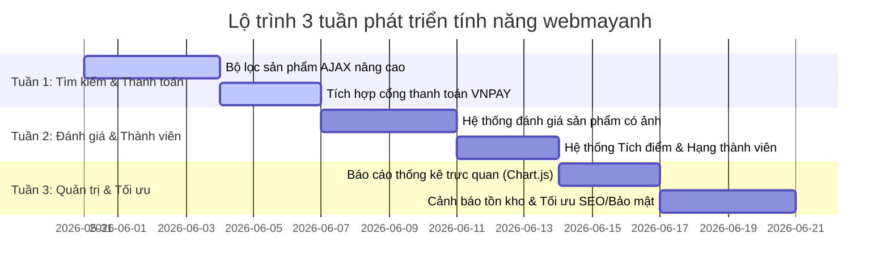

# 🚀 KẾ HOẠCH PHÁT TRIỂN TÍNH NĂNG TRONG 3 TUẦN TỚI (ROADMAP - WEBMAYANH)

Tài liệu này phác thảo lộ trình chi tiết xây dựng các tính năng mới và nâng cấp hệ thống website thương mại điện tử máy ảnh **webmayanh** trong vòng 3 tuần tới. Kế hoạch này được xây dựng dựa trên cấu trúc MVC hiện tại, hệ thống cơ sở dữ liệu đã chuẩn hóa, và các quy tắc kỹ thuật nghiêm ngặt của dự án (Vanilla CSS, BEM, Vanilla JS, Single Entry Point).

---

## 📅 TỔNG QUAN LỘ TRÌNH (OVERVIEW)



---

## 🛠️ CHI TIẾT TỪNG TUẦN (WEEKLY SPRINT DETAILS)

### 🌟 TUẦN 1: BỘ LỌC NÂNG CAO & THANH TOÁN TRỰC TUYẾN

> [!NOTE]
> **Mục tiêu:** Giúp người dùng dễ dàng tìm thấy sản phẩm máy ảnh/ống kính phù hợp và thực hiện thanh toán trực tuyến nhanh chóng, an toàn thay vì chỉ sử dụng phương thức COD truyền thống.

#### 1. Bộ lọc sản phẩm AJAX nâng cao (Advanced Search & Multi-Criteria Filter)
*   **Mô tả:** Nâng cấp trang danh mục (`mayanh.php`, `ongkinh.php`) để người dùng lọc sản phẩm theo nhiều tiêu chí cùng lúc mà không cần load lại trang.
*   **Các tiêu chí lọc:**
    *   *Thương hiệu (NCC):* Canon, Sony, Fujifilm, Nikon... (lấy từ bảng `nha_cung_cap`).
    *   *Khoảng giá:* Lọc động theo thanh trượt kéo (Price Range Slider).
    *   *Thông số kỹ thuật:* Lọc theo độ phân giải, loại cảm biến (Full-frame, APS-C) trích xuất từ trường JSON `thong_so_ky_thuat` trong bảng `hang_hoa`.
*   **Cách thức thực hiện (MVC):**
    *   **Model:** Bổ sung các hàm lọc động trong `ProductModel::getFilteredProducts($conn, $filters)`. Sử dụng Prepared Statements để tránh SQL Injection khi ghép điều kiện.
    *   **Controller:** `ProductController::handleFilterProducts()` nhận dữ liệu từ AJAX (Fetch API) dưới dạng JSON và gọi Model xử lý.
    *   **View & CSS/JS:** Sử dụng `assets/js/mayanh.js` để bắt sự kiện thay đổi của các bộ lọc, thực hiện Fetch request lên server và cập nhật DOM sản phẩm. Viết CSS BEM đồng bộ trong `assets/css/client.css`.

#### 2. Tích hợp cổng thanh toán trực tuyến VNPAY (VNPAY Payment Gateway Sandbox)
*   **Mô tả:** Cho phép khách hàng chọn phương thức thanh toán trực tuyến qua VNPAY bên cạnh COD khi thanh toán ở trang giỏ hàng.
*   **Cách thức thực hiện:**
    *   Cấu hình thông tin VNPAY Sandbox (`vnp_TmnCode`, `vnp_HashSecret`, `vnp_Url`) vào `config.php`.
    *   **Controller:** Nâng cấp `OrderController::handleCheckout()` để kiểm tra nếu phương thức thanh toán là `VNPAY`, hệ thống sẽ khởi tạo URL thanh toán VNPAY và chuyển hướng khách hàng sang cổng thanh toán.
    *   **IPN Handler & Return Page:** Xây dựng endpoint nhận kết quả giao dịch tự động từ VNPAY (`index.php?action=vnpay_ipn`) để cập nhật trạng thái đơn hàng (`trang_thai_don` chuyển sang *DaThanhToan* hoặc *ThatBai*), đảm bảo tính an toàn dữ liệu và chống gian lận.
    *   Tạo trang kết quả thanh toán đẹp mắt tại `view/client/vnpay_return.php`.

---

### 🌟 TUẦN 2: HỆ THỐNG ĐÁNH GIÁ CÓ ẢNH & TÍCH ĐIỂM THÀNH VIÊN

> [!NOTE]
> **Mục tiêu:** Tăng độ uy tín của sản phẩm thông qua đánh giá thực tế của người dùng và kích thích khách hàng mua lại bằng cơ chế tích điểm nâng hạng thành viên.

#### 1. Hệ thống Đánh giá & Bình luận Đa phương tiện (Multimedia Reviews)
*   **Mô tả:** Cho phép khách hàng đã mua sản phẩm đánh giá số sao (1-5★), viết nhận xét và tải lên tối đa 3 hình ảnh thực tế của sản phẩm.
*   **Cách thức thực hiện:**
    *   **Database:** Sử dụng bảng `danh_gia` hiện có. Bổ sung thêm cột `anh_danh_gia` (kiểu dữ liệu TEXT/JSON để lưu trữ danh sách tên file ảnh).
    *   **Model:** Bổ sung hàm trong `ProductModel::addProductReview(...)` và `ProductModel::getProductReviews(...)`.
    *   **Controller:** `ProductController::handleAddReview()` xử lý upload ảnh an toàn (đổi tên file ngẫu nhiên, giới hạn định dạng `.jpg`, `.png`, `.webp`, kích thước < 2MB) theo quy tắc của dự án.
    *   **View & JS:** AJAX form đánh giá trực quan ngay tại `view/client/chitietsanpham.php`. Người dùng có thể xem trước ảnh (image preview) trước khi gửi.

#### 2. Kích hoạt Hệ thống Điểm Tích Lũy & Hạng Thành Viên (Customer Loyalty Program)
*   **Mô tả:** Hiện thực hóa các trường dữ liệu `hang_thanh_vien` và `diem_tich_luy` có sẵn trong bảng `tai_khoan`.
*   **Quy chế hoạt động:**
    *   *Tích lũy:* Khi đơn hàng chuyển sang trạng thái thành công (*DaGiao*), hệ thống tự động cộng điểm tích lũy: **100.000 VNĐ chi tiêu = 1 điểm tích lũy**.
    *   *Phân hạng:* Tự động nâng hạng thành viên khi đạt mốc điểm:
        *   **Hạng Bạc (Silver):** Từ 100 điểm.
        *   **Hạng Vàng (Gold):** Từ 500 điểm.
        *   **Hạng Kim Cương (Diamond):** Từ 1500 điểm.
    *   *Ưu đãi thành viên:* Khi khách hàng đăng nhập thực hiện mua hàng, hệ thống tự động áp dụng mức chiết khấu trực tiếp trên tổng đơn hàng (Bạc: giảm 2%, Vàng: giảm 5%, Kim cương: giảm 10%). Mức giảm giá này sẽ hiển thị rõ ràng trong trang `giohang.php`.
*   **Cách thức thực hiện:**
    *   **Model:** `UserModel::updateLoyaltyPoints($conn, $ma_tk, $points)` và `UserModel::checkAndUpgradeRank($conn, $ma_tk)`.
    *   **Controller:** Tích hợp logic xử lý trong `OrderController::handleUpdateStatus()` khi trạng thái giao hàng được cập nhật bởi Admin.

---

### 🌟 TUẦN 3: BÁO CÁO THỐNG KÊ QUẢN TRỊ, CẢNH BÁO TỒN KHO & BẢO MẬT/SEO

> [!NOTE]
> **Mục tiêu:** Cung cấp cho Admin cái nhìn toàn diện về hoạt động kinh doanh bằng biểu đồ trực quan, tối ưu hóa vận hành kho bãi và hoàn thiện website về mặt kỹ thuật (SEO & Security).

#### 1. Bảng điều khiển quản trị trực quan với Biểu đồ Doanh thu (Admin Dashboard Analytics)
*   **Mô tả:** Thay thế các bảng số liệu thô tại trang `view/admin/admin.php` bằng các biểu đồ cột và biểu đồ đường sinh động biểu diễn doanh thu, số lượng đơn hàng, và danh sách các sản phẩm bán chạy nhất.
*   **Cách thức thực hiện:**
    *   **Thư viện:** Tích hợp thư viện **Chart.js** bằng file JS tĩnh trong `assets/js/admin/chart.min.js` (không dùng link CDN ngoài để tối ưu tốc độ tải và tính ổn định).
    *   **Model:** `AdminModel::getRevenueStatsByPeriod($conn, $startDate, $endDate)` và `AdminModel::getBestSellingProducts($conn, $limit)`.
    *   **Controller:** `AdminController::getAnalyticsData()` trả về JSON chứa chuỗi số liệu theo thời gian (Hôm nay, 7 ngày qua, 30 ngày qua, năm nay).
    *   **View & JS:** Sử dụng Fetch API trong `assets/js/admin.js` để lấy dữ liệu thống kê và vẽ biểu đồ động lên thẻ `<canvas>`.

#### 2. Quản lý Tồn kho & Cảnh báo Hàng sắp hết (Inventory Smart Alert)
*   **Mô tả:** Theo dõi chi tiết số lượng sản phẩm còn lại trong kho từ bảng `ton_kho_chi_tiet`.
*   **Cơ chế hoạt động:**
    *   Khi số lượng tồn của một sản phẩm giảm xuống dưới mức tối thiểu (ví dụ dưới 3 chiếc), hệ thống quản trị sẽ hiển thị nhãn cảnh báo đỏ nổi bật (Ví dụ: *"Sắp hết hàng"*).
    *   Tự động gửi email thông báo cho quản trị viên qua hệ thống `SmtpMailer` đã cấu hình khi một sản phẩm chính thức hết hàng để kịp thời nhập thêm sản phẩm mới.

#### 3. Tối ưu hóa SEO & Bảo mật chuyên sâu (SEO & Security Hardening)
*   **Tối ưu SEO:**
    *   *Thẻ Meta động:* Tự động tạo thẻ `<title>`, `<meta name="description">` và thẻ OpenGraph (`og:title`, `og:image`) thân thiện mạng xã hội cho từng trang chi tiết sản phẩm và bài viết dựa trên cơ sở dữ liệu.
    *   *Sitemap tự động:* Viết script tự động xuất file `sitemap.xml` động chứa toàn bộ link sản phẩm và bài viết để công cụ tìm kiếm của Google dễ dàng lập chỉ mục (index).
*   **Bảo mật chuyên sâu:**
    *   *Chống CSRF (Cross-Site Request Forgery):* Triển khai thẻ CSRF Token ngẫu nhiên cho tất cả các POST Form (đặc biệt là Form Đăng nhập, Đổi mật khẩu, và Thanh toán).
    *   *XSS Filter:* Rà soát và bọc toàn bộ đầu ra hiển thị bằng hàm `htmlspecialchars()` hoặc `strip_tags()` để ngăn chặn mã độc JavaScript thực thi trong trình duyệt người dùng.
    *   *Bảo mật thư mục uploads:* Cấu hình file `.htaccess` trong thư mục `uploads/` nhằm vô hiệu hóa việc thực thi bất kỳ file script nào (như `.php`, `.phtml`, `.sh`) được tải lên dưới danh nghĩa tệp ảnh.

---

## 🏗️ QUY TẮC PHÁT TRIỂN CỐT LÕI (TECHNICAL ALIGNMENT)

Để đảm bảo các tính năng trên hoạt động ăn khớp với mã nguồn hiện tại, toàn bộ tiến trình code phải tuân thủ nghiêm ngặt 3 nguyên tắc vàng sau từ file `rule.md`:

1.  **Tuyệt đối tuân thủ mô hình MVC thuần:**
    *   *Sai lầm cần tránh:* Gọi trực tiếp câu lệnh SQL `SELECT ...` hoặc `$conn->query(...)` ngay trong file View giao diện.
    *   *Quy trình đúng:* JS gọi AJAX ➔ `index.php` định tuyến ➔ Controller kiểm tra quyền/validate dữ liệu ➔ Model lấy dữ liệu CSDL ➔ Trả về View dạng JSON hoặc biến PHP để in ra màn hình.
2.  **Nguyên tắc Giao diện & CSS:**
    *   **Không** sử dụng Tailwind CSS hay bất kỳ CSS Framework nào khác ngoài Vanilla CSS tự viết.
    *   Viết CSS tách biệt trong `assets/css/` dùng chuẩn đặt tên BEM. Sử dụng các biến màu sắc cốt lõi như `--color-primary`, `--color-accent` để đồng bộ với bộ nhận diện thương hiệu hiện tại.
3.  **Kiểm tra an toàn kết nối CSDL:**
    *   Mọi hàm trong file Model mới phải bắt đầu bằng kiểm tra điều kiện an toàn:
        ```php
        if ($conn === false) {
            return []; // Hoặc giá trị lỗi tương ứng
        }
        ```

---

*Tài liệu này đóng vai trò là kim chỉ nam cho sự phát triển của dự án webmayanh trong thời gian tới. Các mục công việc trên có thể được cập nhật linh hoạt dựa trên phản hồi thực tế của khách hàng.*
